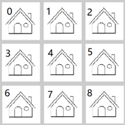

# EinsteinBDD
使用二元决策图（BDD）及程序解决爱因斯坦谜题

## 说明

使用二元决策图（BDD）及 BuDDy 库进行编程解决经典的爱因斯坦问题

## 爱因斯坦问题

房子的分布：

有5个人：

- 有着5种不同的**国籍**
- 住着5种不同颜色的**房子**
- 抽着5种不同类型的**烟**
- 养着5种不同类型的**宠物**
- 喝着5种不同类型的**饮料**

**其中每个人的同一类属性都不相同，比如不能有两个喝茶的人或者不能有2个住在白房子里的人**

假如给定以下 15 种命题：

1. 挪威人住在1号房子里
2. 英国人住在红房子里
3. 绿房子在白房子的左边
4. 丹麦人喝茶
5. 抽 Rothmans 的住在养猫人的旁边
6. 住在黄房子里的抽 Dunhill
7. 德国人抽 Marlhoro
8. 住中间的人喝牛奶
9. 抽 Rothman和喝水的是邻居
10. 瑞典人养狗
11. 挪威人住在蓝房子里
12. 住在蓝房子里的人养马
13. 抽 Philip Morris 的人喝啤酒
14. 绿房子里的人喝咖啡

*问：谁养鱼？*

## 解决过程

1. 使用二元决策图的方式对布尔函数进行表示

   n 个二进制称为一个解释。

   与布尔函数（БФ）相关的任务：

   - 找到 БФ 在具体解释下的值
   - 找到能使 БФ 成真的解释
   - 确定 БФ 是可满足式、永真式还是矛盾式
   - 检查两个 БФ 是否相等
   
   

## 使用布尔函数表达逻辑问题

我们需要使用布尔函数解决这些问题，就要把这些问题呈现为一组逻辑约束

### 形式化问题

构建一个系统，这个系统：

- 有 `N` 个对象
- ==总共?==拥有 `M` 个属性

这里我们将对象选择为房子的编号，也就是说 `N=5` ，那么房子的属性（颜色） `M=5`

对于其他的对象也都拥有不同的属性，每个属性会有 ==N 种==不同的值

| 编号 | 名称       | 值                                                    |
| ---- | ---------- | ----------------------------------------------------- |
| 1    | 国籍       | 红色、白色、绿色、黄色、蓝色                          |
| 2    | 房子的颜色 | 英国、瑞典、丹麦、挪威、德国                          |
| 3    | 饮料       | 茶、牛奶、咖啡、水、啤酒                              |
| 4    | 宠物       | 猫、马、狗、鸟、鱼                                    |
| 5    | 烟         | Rothmans、Dunhill、Marlboro、Pall Mall、Philip Morris |

### 爱因斯坦的难题的性质和值

我们==令 `j` 为属性的编号？==

我们需要9个人，他们拥有4种属性，每种属性有9个性质

|      |      |      |      |      |      |      |      |      |      |
| ---- | ---- | ---- | ---- | ---- | ---- | ---- | ---- | ---- | ---- |
|      |      |      |      |      |      |      |      |      |      |
|      |      |      |      |      |      |      |      |      |      |
|      |      |      |      |      |      |      |      |      |      |
|      |      |      |      |      |      |      |      |      |      |

*n1 = 6, *

*n2 = 3, *

*n3 = 5, *

*n4 = 4.*

---

*n1 = 6, *

1. F 住在 1 号房
2. E住在  4 号房
3. B 用的是三星的手机
4. C 喜欢吃 Говядина
5. G 用的是 Google 手机
6. H 喜欢吃西瓜

---

*n2 = 3, *

1. 用Google手机的喜欢吃鸡
2. 喜欢吃香蕉的人尾号是 5
3. 用华为手机的人尾号是1

---

*n3 = 5, *

1. 住在C下面的人喜欢吃土豆
2. 住在用苹果手机下面的人尾号是8
3. 喜欢吃香蕉的人右上角住着A
4. 住在B下面的人用HTC手机
5. 住在用vivo手机下面的人喜欢吃甘蓝

---

*n4 = 4.*

1. F 指向 I
2. A 指向 B
3. D 指向 G
4. E 指向 H

