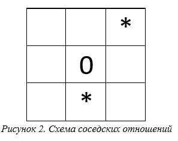

# EinsteinBDD
使用二元决策图（BDD）及程序解决爱因斯坦谜题

## 说明

使用二元决策图（BDD）及 BuDDy 库进行编程解决经典的爱因斯坦问题

## 爱因斯坦问题

房子的分布：

| 0    | 1    | 2    | 3    | 4    |
| ---- | ---- | ---- | ---- | ---- |

有5个人：

- 有着5种不同的**国籍**
- 住着5种不同颜色的**房子**
- 抽着5种不同类型的**烟**
- 养着5种不同类型的**宠物**
- 喝着5种不同类型的**饮料**

**其中每个人的同一类属性都不相同，比如不能有两个喝茶的人或者不能有2个住在白房子里的人**

假如给定以下 15 种命题：

1. 挪威人住在1号房子里
2. 英国人住在红房子里
3. 绿房子在白房子的左边
4. 丹麦人喝茶
5. 抽 Rothmans 的住在养猫人的旁边
6. 住在黄房子里的抽 Dunhill
7. 德国人抽 Marlhoro
8. 住中间的人喝牛奶
9. 抽 Rothman和喝水的是邻居
10. 瑞典人养狗
11. 挪威人住在蓝房子里
12. 住在蓝房子里的人养马
13. 抽 Philip Morris 的人喝啤酒
14. 绿房子里的人喝咖啡

*问：谁养鱼？*

## 解决过程

1. 使用二元决策图的方式对布尔函数进行表示

   n 个二进制称为一个解释。

   与布尔函数（БФ）相关的任务：

   - 找到 БФ 在具体解释下的值
   - 找到能使 БФ 成真的解释
   - 确定 БФ 是可满足式、永真式还是矛盾式
   - 检查两个 БФ 是否相等
   
   

## 使用布尔函数表达逻辑问题

我们需要使用布尔函数解决这些问题，就要把这些问题呈现为一组逻辑约束

### 形式化问题

构建一个系统，这个系统：

- 有 `N` 个对象
- 每个对象又各拥有 `M` 个属性

这里我们将对象选择为房子的编号，也就是说 `N=5` ，那么房子的属性（颜色） `M=5`

对于其他的对象也都拥有不同的属性，每个属性会有 N 种不同的值

| 编号 | 名称       | 值                                                    |
| ---- | ---------- | ----------------------------------------------------- |
| 1    | 国籍       | 红色、白色、绿色、黄色、蓝色                          |
| 2    | 房子的颜色 | 英国、瑞典、丹麦、挪威、德国                          |
| 3    | 饮料       | 茶、牛奶、咖啡、水、啤酒                              |
| 4    | 宠物       | 猫、马、狗、鸟、鱼                                    |
| 5    | 烟         | Rothmans、Dunhill、Marlboro、Pall Mall、Philip Morris |

---

# **Использование бинарных решающих диаграмм для решения логических задач**

## Ведение

Одной из важных задач искусственного интеллекта (ИИ) является задача удовлетворения ограничений (УО) (constraint satisfaction problem). Теория УО предлагает удобный аппарат и простую формальную схему для представления и решения комбинаторных задач ИИ.

Целью решения задачи УО является нахождение значений переменных, удовлетворяющих заданным ограничениям.

В данной курсовой работе рассмотрим задачу УО. Используем специальную эффективную форму представления БФ, Binary Decision Diagram (BDD) – Бинарные решающие диаграммы.

Основные свойства BDD: эффективное представление БФ, представление БФ в форме BDD является каноническим (единственным).

Для программирования задач с пользованием BDD разработана специальна библиотека BUDDy на языке C++.

## Цель работы

 Целью работы является решение задачи Эйнштейна, также ознакомление с бинарными решающим диаграммами.

## Задание

Реализация программы, которая решает задачу Эйнштейна с помощью библиотеки BuDDy.

## Постановка задачи

Имеется *N* *= 9* объектов расположенных следующим образом:

«Соседские» отношения между объектами определены относительно центрального объекта следующим образом:

Склейка: По 2-му столбцу присутствует «склейка». Так как у элементов первого столбца нет никаких соседей, склейка совсем не действует в нашим случае.

Таким образом, соседями центрального элемента являются элементы, находящиеся низу и сверху-справа.

- у элементов 0, 2, 5, 6 по одному соседа
- у элементов 1, 3, 4, 7 по два соседа
- у элементов 8 нет соседей

**Ограничения:**

-  Необходимо выбрать M = 4 свойств, принимающих N различных значений. 
- Задать n1 ограничений типа 1, n2 ограничений типа 2 (типы ограничений возьмите из задачи Эйнштейна, ni > 0) по своему варианту. 
-  Для ограничений типа 3 и типа 4 использовать «соседские» отношения. Задать n3 ограничений подобных отношениям типа 3 и n4 ограничений подобных отношениям типа 4 в соответствии со своим заданием. 
- Найти все возможные решения; 
- Придумать физическую интерпретацию задачи; 
- Если задача имеет не одно решение, следует добавить и/или изменить некоторые ограничения так, чтобы задача имела только одно единственное решение.
- Если задача не имеет решений, следует удалить и/или изменить некоторые ограничения так, чтобы задача имела только одно единственное решение. Ограничение типа n7 удалять нельзя
- Для выполнения задания необходимо написать программу на языке C++ с использованием библиотеки BuDDy

 **Для моего варианта значения числа ограничений типов 1-4:** 

- *n1 = 6*
- *n2 = 3*
- *n3 = 5*
- *n4 = 4*

## Ход выполнения работы 

### Физическая интерпретация задачи

В блоке (как показано на рисунке) 9 соседних домов, пронумерованных от 0 до 8.

В каждом доме живут разные люди с разными инициалами, разными номерами мобильных телефонов с разными последними цифрами, разными марками мобильных телефонов и разными предпочтениями в еде.

Они указывают друг на друга в следующих отношениях:

**Имеем 4 множества свойств:**

| **Номер**                    | **0**  | **1**  | **2**  | **3**   | **4**   | **5**    | **6**   | **7**  | **8**     |
| ---------------------------- | ------ | ------ | ------ | ------- | ------- | -------- | ------- | ------ | --------- |
| **Инициалы фамилии**         | A      | B      | C      | D       | E       | F        | G       | H      | I         |
| **Последняя цифра телефона** | 0      | 1      | 2      | 3       | 4       | 5        | 6       | 7      | 8         |
| **Марка телефона**           | Apple  | Xiaomi | Huawei | Sansung | Realme  | HTC      | vivo    | Google | Oppo      |
| **Что любит есть**           | Огурец | Арбуз  | Тыква  | Курица  | Свинина | Говядина | Капуста | Банан  | Картофель |

Известны также следующие утверждения об этих нейронах:

- **n1**
  1. `F` живет в доме 1
  2. Кто пользуется телефона Samsung, живет в доме 5
  3. `E` живет в доме 3
  4. Кто любит есть говядину, живет в доме 0
  5. Кто пользуется телефоном Google, живет в доме 7
  6. Кто любит арбуз, живет в доме 6
- **n2**
  1. Обладатели телефонов Google любят есть курицу
  2. Те, чья последняя цифра номера телефона равна 5, любят есть бананы
  3. Обладатели телефонов Huawei, последняя цифра номера телефона равна 1
- **n3**
  1. Человек, живущие под `C`, любят картофель
  2. Человек, живущий под человеком, который пользуется телефоном Apple, имеет последняя цифра номера телефона равна 8
  3. Человек с телефонами OPPO живут под ком любителями картофеля
  4. В правом верхнем `F` живет `I`
  5. Человек, который живет под телефоном VIVO, любит есть капусту
- **n4**
  1. Кто пользуется телефоном Huawei, указывающий на `I`
  2. Кто пользуется телефоном VIVO, указывающий на ком любят есть говядину
  3. `D`, указывающий на `G`
  4. `E`, указывающий на `H`

**Задача: найти все возможные решения.**

### Наложение дополнительных ограничений

В результате исполнения кода программы имеет *769532429858451436339200* решений без добавления ограничения n5. n5 не может быть выполнено, так как количество решений слишком велико, а время, необходимое для выполнения ограничения n5, слишком велико. Во время итеративного процесса нахождения ограничений, приводящих программу к получению единственного решения, был сформирован набор дополнительных ограничений:

- **n1**
  1. `A` живет в доме 2
  2.   `D` живет в доме 1
  3. `H` живет в доме 6
  4. Кто последняя цифра номера телефона равна 2, живет в доме 2
  5. Кто последняя цифра номера телефона равна 0, живет в доме 3
  6. Кто последняя цифра номера телефона равна 8, живет в доме 7
  7. Кто любит есть тыква, живет в доме 1
- **n2**
  1. Кто с телефонами Apple любят есть бананы
  2. `I` пользуется телефоном HTC
  3. Кто с телефонами Xiaomi любят есть говядину
  4. Кто последняя цифра номера телефона равна 6, любят есть cвинина
  5. Кто последняя цифра номера телефона равна 4, пользуется телефоном Samsung
  6.  `C` последняя цифра номера телефона равна 3
  7. Кто последняя цифра номера телефона равна 0, пользуется телефоном Realme
  8. Кто пользуется телефоном OPPO, любят есть cвинина арбуз
-  **n3**
  1. В правом верхнем `D` живет `A`

### Результат

Вычисленное программой решение может быть показано следующей таблицей:

| 2 3 1 5 | 5 1 2 2 | 0 2 6 0 |
| ------- | ------- | ------- |
| 4 0 4 8 | 3 5 0 7 | 1 4 3 6 |
| 7 7 8 1 | 6 8 7 3 | 8 6 5 4 |

Физическая интерпретация решения отражена в этой таблице:

| **Номер (домика)**           | **0**    | **1**  | **2**  | **3**     | **4** | **5**   | **6** | **7**  | **8**   |
| ---------------------------- | -------- | ------ | ------ | --------- | ----- | ------- | ----- | ------ | ------- |
| **Инициалы фамилии**         | C        | F      | A      | E         | D     | B       | H     | G      | I       |
| **Последняя цифра телефона** | 3        | 1      | 2      | 0         | 5     | 4       | 7     | 8      | 6       |
| **Марка телефона**           | Xiaomi   | Huawei | vivo   | Realme    | Apple | Sansung | Oppo  | Google | HTC     |
| **Что любит есть**           | Говядина | Тыква  | Огурец | Картофель | Банан | Капуста | Арбуз | Курица | Свинина |

 Для более наглядного представления мы можем представить это в виде таблицы:

## Вывод

В ходе выполнения курсовой работы получился опыт работы с библиотекой BuDDy и применил бинарные решающие диаграммы для решения задачи Эйнштейна, принадлежащей к классу задач проблемы удовлетворения ограничениям. Как мы и ожидали, структура BDD значительно упрощает поиск и подсчёт числа интерпретаций, на которых функция от большого множества переменных возвращает значение True.

## Список литературы

Беляев А. Б., Шошмина И. В. Использование бинарных решающих диаграмм для решения логических задач. Библиотека Buddy – СПб: Санкт-Петербургский государственный политехнический университет – 26 с.

\2.  Документация по использованию библиотеки BuDDy // BuDDy: A BDD package – 2007. – URL: http://buddy.sourceforge.net/manual/ (дата обращения: 14.12.2018).

\3. Рассел С. Искусственный интеллект: современный подход. 2е изд.: Пер. с англ. / С. Рассел, П. Норвиг М.: Вильямс, 2006. 1408 с.

\4. Krzysztof R. Apt. Principles of Constraint Programming – Cambridge: Cambridge University Press, 2003. – 407 с.

\5. Henrik Reif Andersen. An Introduction to Binary Decision Diagrams // Lecture notes for 49285 Advanced Algorithms E97. – [Denmark, 1997] – URL: http://www.cs.utexas.edu/~isil/cs389L/bdd.pdf (дата обращения: 14.12.2018).

